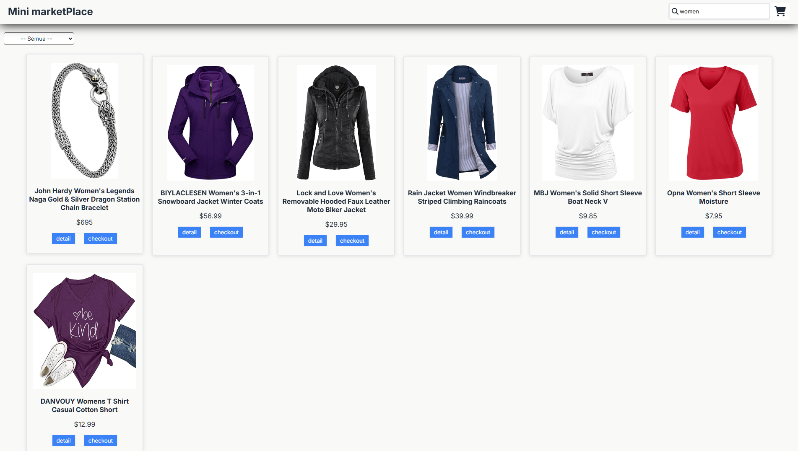
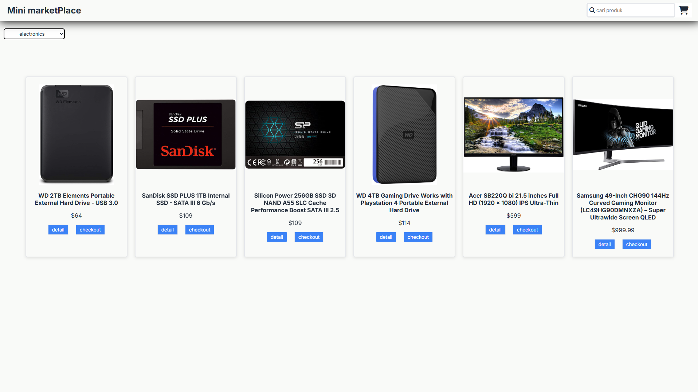
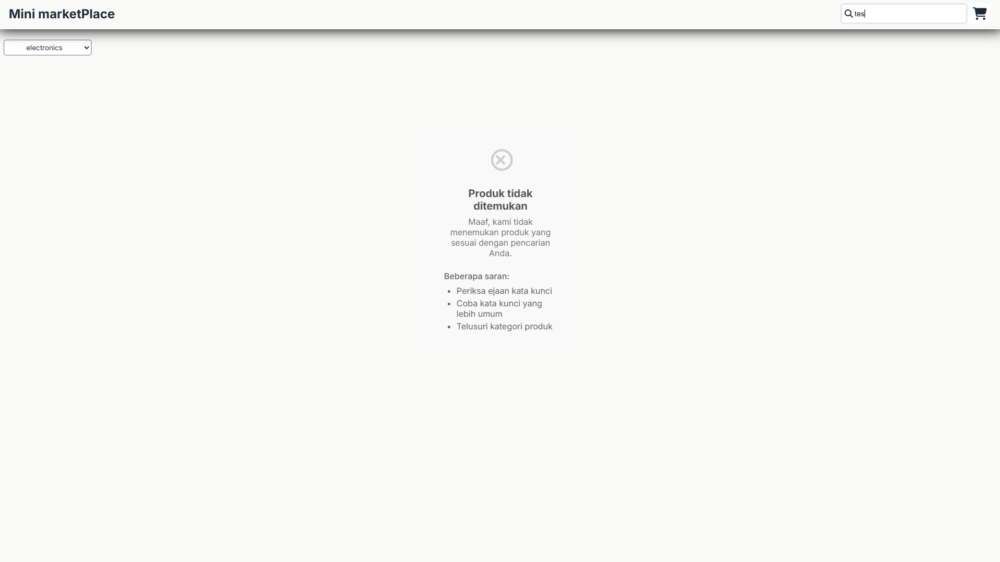
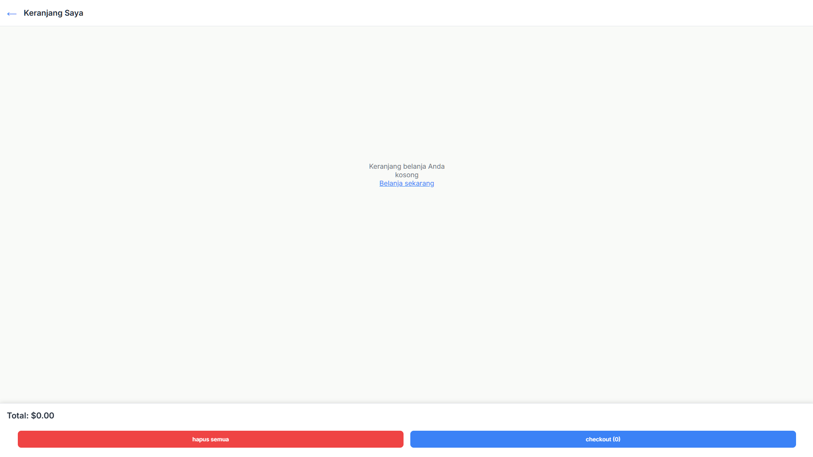

# 🛍️ Mini Marketplace

Project latihan membuat website marketplace sederhana menggunakan **HTML**, **CSS**, dan **JavaScript** (tanpa framework).  
Dilengkapi fitur pencarian, filter kategori, tampilan detail produk, dan sistem keranjang belanja (checkout).

## ✨ Fitur Utama

- 🔎 Pencarian produk (dengan debounce untuk performa optimal)
- 🧩 Filter produk berdasarkan kategori
- 🖼️ Modal popup untuk detail produk
- 🛒 Tambahkan ke keranjang dan simpan ke `localStorage`
- ➕ Tambah/kurangi jumlah produk di keranjang
- ❌ Hapus produk satuan atau semua
- 📦 Simulasi checkout belanja

## 💡 Teknologi yang Digunakan

- HTML5 + CSS3
- JavaScript DOM
- Fetch API (dari [FakeStoreAPI](https://fakestoreapi.com/))
- LocalStorage (untuk simpan data keranjang)

## 🚀 Demo (GitHub Pages)

👉 [Klik untuk melihat demo](https://fikar-dev.github.io/mini-marketplace/)  
> *Ganti link dengan URL GitHub Pages milik kamu*

## 🗂️ Struktur Folder
"Mini-marketplace/
├── index.html
├── keranjang.html
├── css/
│ └── style.css
└── js/
├── main.js
└── keranjang.js"

## 🧪 Cara Menjalankan

1. Clone repo atau download ZIP
2. Buka `index.html` di browser
3. Interaksi seperti:
   - Cari produk
   - Lihat detail (modal)
   - Tambahkan ke keranjang
   - Buka `keranjang.html` untuk lihat isi keranjang

## 📸 Preview
### 🏠 Halaman Utama

### 🛒 Halaman Keranjang

## 🤝 Kontribusi

Proyek ini dibuat sebagai latihan pribadi. Tapi feel free untuk fork dan improve!

## 👨‍💻 Author

> Zulfikar Aslam Said  
> Universitas Halu Oleo — Ilmu Komputer  
> [LinkedIn](#) | [GitHub](https://github.com/B1gels)

